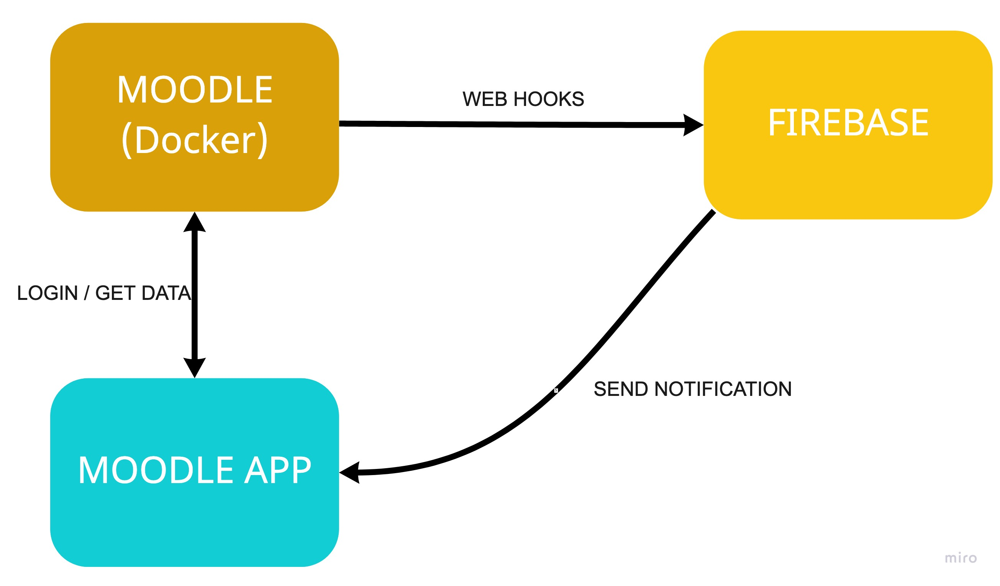
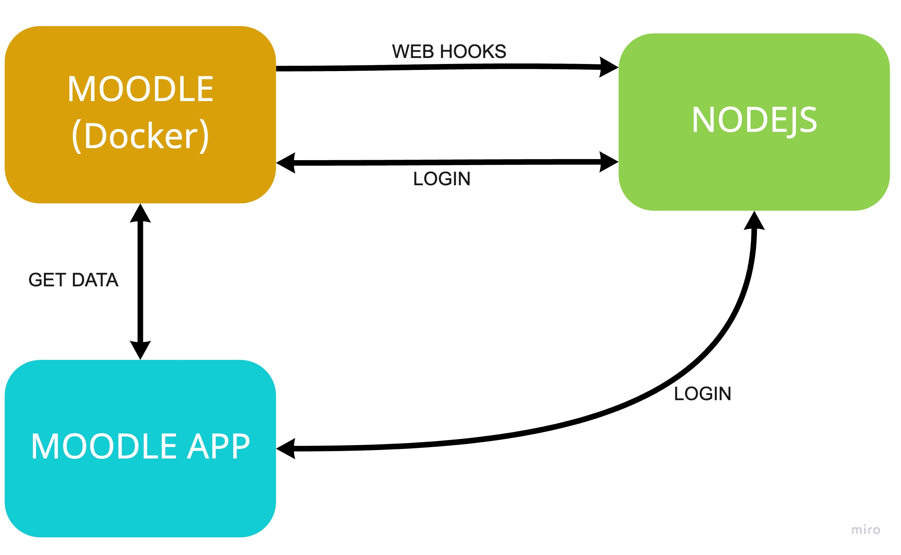

# Moodle API and webhooks

This project with 2 scenarios. For this example I have create an App on React Native [(repo is here)](https://github.com/CrisRonda/ReactNative-Moodle). 

# How does it work?
For this example I have considered 2 scenarios one for: 
- Firebase and FCM
- Custom server with NodeJS
## Scenario 1
Next image explain flow of login and notifications to app 
<div style='margin-bottom: 8px'>

</div>

## Scenario 2 
In this scenario you can do anything that you want in your nodeJS server.
For example the login I use nodejs server, while data of courses I can get of moodle directly and presenta on React Native Moodle App [(repo is here)](https://github.com/CrisRonda/ReactNative-Moodle) but
<div style='margin-bottom: 8px'>

</div>

**Note:** Scenario 2 is complicate and isn't functional but is just an example 😉

# How to run
For this example is required an Moodle App you can use my Moodle App build in React Native [(repo is here)](https://github.com/CrisRonda/ReactNative-Moodle)

1. Up docker with moodle `docker-compose up`
2. Go to localhost and login with 
   ```txt
   username: user
   password: bitnami
   ```
3. [Install plugin local-webhooks](https://moodle.org/plugins/local_webhooks) on moodle and configure your webhooks
4. Run your Moodle App 
5. Give me star 😬